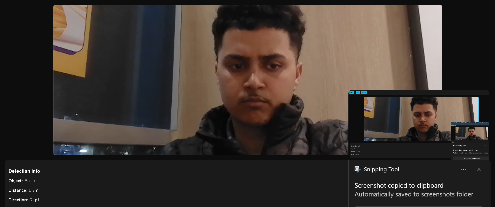
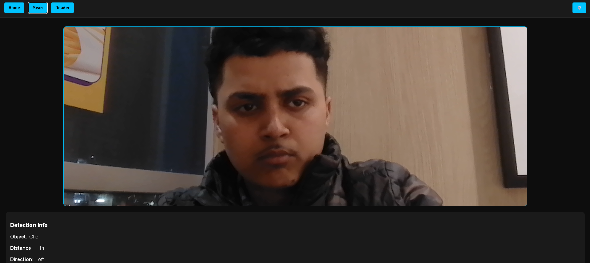

# 🚀 AR Accessibility Assistant

An Augmented Reality (AR) based application designed to assist users by detecting real-world objects in real-time using computer vision.

---

## 🧠 Project Overview

This project was developed as part of:

**COSC-3506-W04 - Software Engineering**
**Algoma University – Winter 2026**

The system aims to provide an accessibility-focused solution by identifying objects (e.g., person, chair, bottle) through a live camera feed and displaying contextual information.

---

## 🎯 Problem Statement

Many individuals (especially those with accessibility needs) face challenges in understanding their surroundings.

This project attempts to solve this by:

* Detecting objects in real-time
* Providing visual feedback through an AR interface

---

## 🛠️ Tech Stack

* **Frontend:** HTML, CSS, JavaScript
* **Backend:** Python (Flask)
* **Computer Vision:** OpenCV (DNN Module)
* **Model:** MobileNet SSD (Caffe)

---

## 📂 Project Structure

```
AR-Project/
├── frontend/        # UI (HTML, CSS, JS)
├── backend/         # Flask + OpenCV
│   ├── app.py
│   ├── model/       # AI models
│   └── utils/
├── assets/          # Images & demo files
└── README.md
```

---

## 📸 Demo

<p align="center">
  
  
  
  
</p>

---

## 🚧 Current Status

⚠️ The project is under active development.

### Known Issue:

* Object detection is not producing accurate real-time results
* Example: Displays incorrect labels (e.g., "chair" instead of "person")

### Work in Progress:

* Fixing model integration with OpenCV
* Improving detection pipeline
* Enhancing real-time accuracy

---

## 🎯 Features

* [x] Camera integration
* [x] Basic UI for object display
* [ ] Real-time object detection (in progress)
* [ ] Accurate labeling
* [ ] Distance estimation

---

## 🧩 Software Engineering Process (SDLC)

This project follows the **Agile Development Model**, covering:

* Requirement Analysis
* System Design (UML, Wireframes)
* Implementation (Frontend + Backend)
* Testing (Functional & Non-functional)
* Deployment (In progress)

---

## 🧪 Testing

* Black-box testing performed
* Functional and non-functional test cases documented
* Test report includes:

  * Expected vs Actual Results
  * Performance observations

---

## 🌍 Community & Collaboration

We welcome contributors and feedback from the community.

Special welcome to members from Civic Tech Toronto who are interested in building technology for social good. Your insights, suggestions, and contributions are highly appreciated 🙌

If you'd like to collaborate:

* Open an issue
* Submit a pull request
* Share feedback on improving accessibility features

Together, we can make this project more impactful.

---

## 🤝 Contributions

Contributions are welcome!

If you'd like to help:

* Fix object detection issues
* Improve model performance
* Enhance UI/UX

Feel free to open an issue or submit a pull request 🙌

---

## 📬 Contact

**Bhavneet**
Computer Science Student @ Algoma University

---

## ⭐ Note

This project is part of an academic course but is being developed further as a real-world application.
